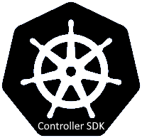

# .NET operator SDK

Build Kubernetes Operators in C# (or whatever .NET language) without hassle.

Inspired by [this post](https://blog.container-solutions.com/cloud-native-java-infrastructure-automation-with-kubernetes-operators) I thought the .NET community should also have an easy way of creating a Kubernetes Operator with their favorite language. ;)

So, here it is... (you can also find it at [NuGet](https://www.nuget.org/packages/ContainerSolutions.Kubernetes.OperatorSDK/))

I am pretty new on the internals of Kubernetes and this was a fun way to discover how the API and other resources work. I am I'm not saying this is a great/production-ready solution.

Also based on the post from above I thought of doing a simple example, and created a `CustomResourceDefinition` to create Microsoft SQL Server databases.
You can take a look at the sample [here](./samples/mssql-db), maybe more examples will eventually develop, it depends on the traction of the project.

## Usage

The .NET operator SDK is a thin wrapper around the [KubernetesClient](https://github.com/kubernetes-client/csharp) providing a few classes and interfaces specifically for creating an operator controller.

### Reference in your project

First of all, include the [NuGet](https://www.nuget.org/packages/ContainerSolutions.Kubernetes.OperatorSDK/) package of the SDK into your project (normally a .NET Core Class Library).

`dotnet add package ContainerSolutions.Kubernetes.OperatorSDK`

### Create you `CustomResourceDefinition` (CRD)

This is important because your `CRD` will describe the name, group, version, and properties of your operator. There's a base class in the SDK called `ContainerSolutions.OperatorSDK.BaseCRD` from which you have to inherit your own CRD class and add the appropriate `Spec`(properties).

*Note: In the near(?) future and want to add a CRDToCsharp generator. Given your yaml file, create the appropriate classes for the operator.*

### Implement your actions

You need to define what will happen when one of your newly defined objects get created, and deleted, what about modified?

There's an interface called `ContainerSolutions.OperatorSDK.IOperationHandler<T>` which contains all the needed methods that the operator will call when one of these events gets raised.

### Don't forget the reconciliation loop!

The methods described above will be called when someone explicitly creates (deletes or modifies) one of your objects in the cluster. But what happens if for some reason the defined resource fails. 

Think about the `Deployment` controller. When a deployment gets created it spins up a `Pod` (actually, as many Pods as the replica stated) and if one of the Pods crashes or deletes it, the Deployment controller will realize that the desired state does not equal to the actual/real state, so, it'll try to spin up another `Pod`.

The same thing could (should?) happen when your controller. Your resource can fail or be modified and you need to realize that there was a change and proceed accordingly.

That's what the `CheckCurrentState` of the `IOperationHandler` is for. Your CRD will have a `ReconciliationCheckInterval`property which defaults to 5 (seconds). This interval will be used to call your function (`CheckCurrentState`) where you'll have to check on the existing and desired resources.

### Samples

There's one example included with the SDK which I believe it's the easiest way of understanding how to use it.

Take a look a the [MSSQLDB](./samples/mssql-db) sample to see how it works.
